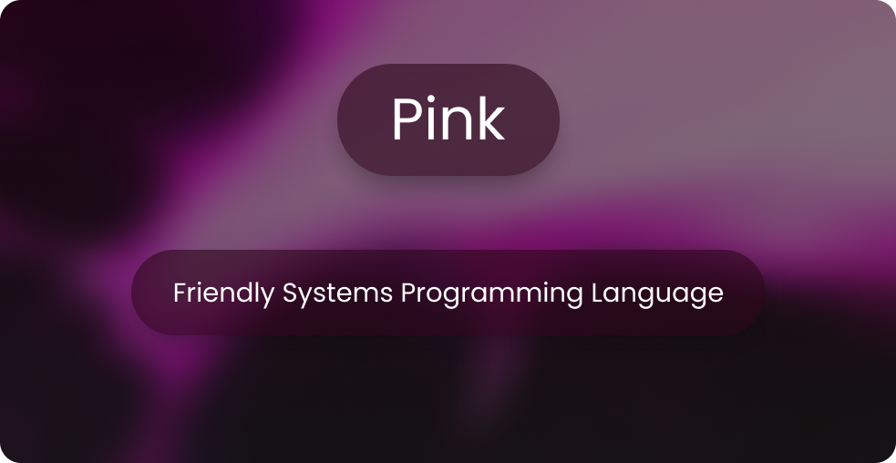

<p align="left">
  
</p>

```pink
import libc

fun main() {
  printf("Hello, Pink");
}
```

## Building

See [`BUILDING.md`](./BUILDING.md)

## License

Pink is public domain, with the hope of people creating cool things with pink.
